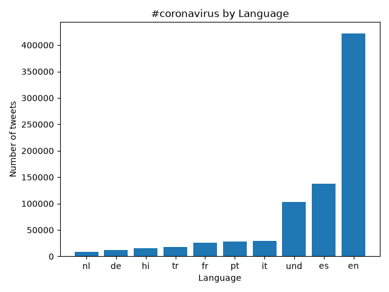
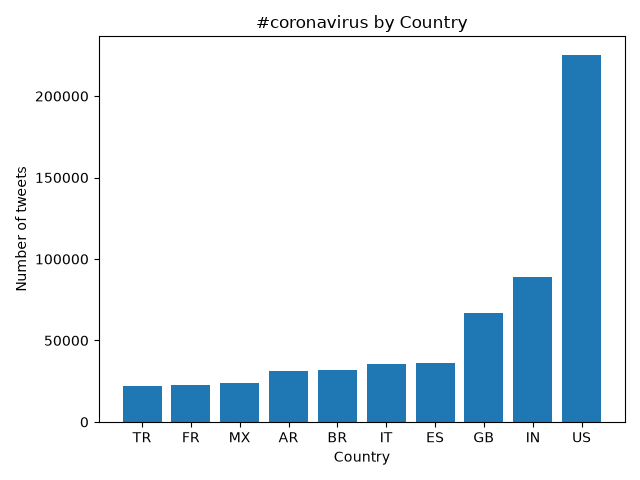
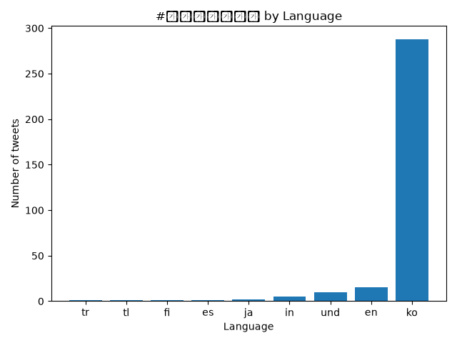
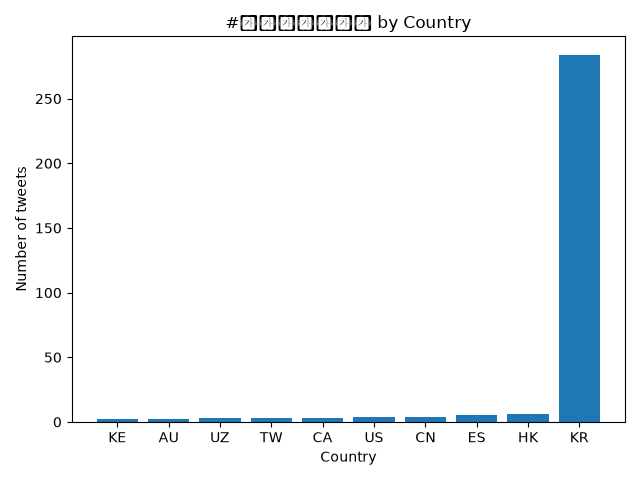
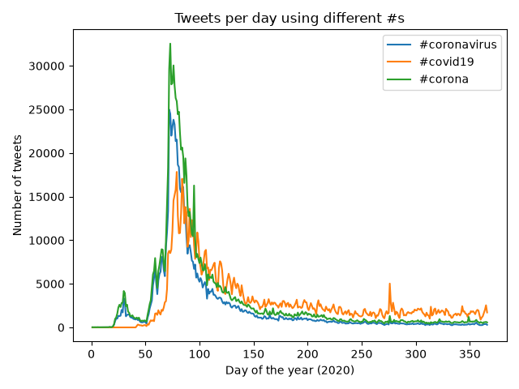
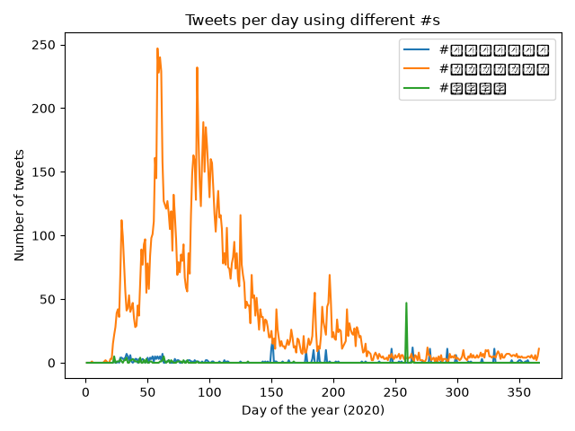

# Coronavirus Twitter Analysis

In this project I analyzed all geotagged tweets sent in 2020 (about 1.1 billion tweets) to track how hashtags about the coronavirus spread on social media, by language, by country, and over time.

## How it works

The tweets are stored as one zip file per day (366 files for 2020). I processed them with the MapReduce approach:

- **Map:** `src/map.py` reads one day of tweets and counts how many tweets used each coronavirus-related hashtag, broken down by language and by country. `run_maps.sh` runs `map.py` on all 366 days in parallel using `nohup` and `&`, so the jobs kept running in the background after I logged out.
- **Reduce:** `src/reduce.py` adds the daily counts together into yearly totals.
- **Visualize:** `src/visualize.py` makes bar graphs of the top 10 languages or countries for a hashtag, and `src/alternative_reduce.py` plots how many tweets used each hashtag on each day of the year.

## Results

### #coronavirus by language

This plot shows the 10 languages whose tweets used #coronavirus most often in 2020. English is by far the most common, followed by Spanish. "und" is Twitter's code for tweets whose language it could not detect.

### #coronavirus by country

This plot shows the 10 countries that sent the most tweets using #coronavirus. The United States is far ahead of every other country.

### #코로나바이러스 by language

#코로나바이러스 is "coronavirus" in Korean. This plot shows which languages' tweets used the Korean hashtag the most.

### #코로나바이러스 by country

This plot shows which countries sent the most tweets using the Korean hashtag, which shows where it was used outside of English-language Twitter.

### Tweets per day: English hashtags

This plot compares three English hashtags people used for the virus, #coronavirus, #covid19 and #corona, and shows how the popularity of each changed day by day over 2020.

### Tweets per day: Korean, Japanese and Chinese hashtags

This plot shows the word "coronavirus" as a hashtag in Korean (#코로나바이러스), Japanese (#コロナウイルス) and Chinese (#冠状病毒), and how often each one was used on each day of 2020.
